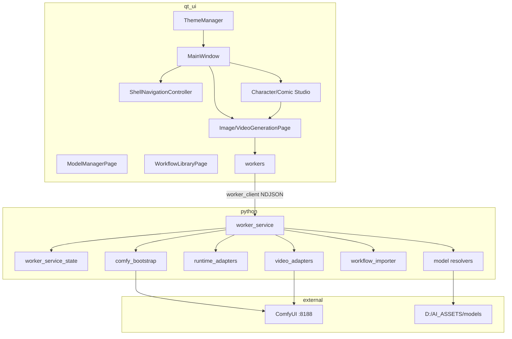

# Dependency Map

## Build-time

- CMake ≥3.21, VS 2022 gen, Qt 6.10.2 (+fallbacks), libwebp FetchContent for WebP thumbs.
- Python 3.12 project `.venv` (worker); Comfy **isolated** venv post cutover.

## Related

[[Three-Layer Architecture]] · [[Repository Map]] · [[Dev Environment]]
