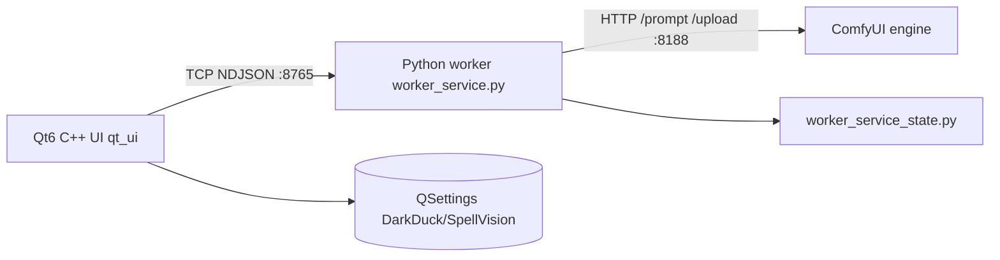

# Three-Layer Architecture

## Ownership split

| Layer | Owns | Does not own |
|-------|------|--------------|
| **C++/Qt6 UI** | Shell, pages, request build, queue UX, theme, preview, rail | Comfy graph details, model load |
| **Python worker** | Job lifecycle, routing, adapters, graph builders, Comfy lifecycle | Pixel paint / chrome |
| **ComfyUI** | Node execution, custom nodes, VRAM during sample | Product UX |

## Settled decisions

1. **ComfyUI stays the execution engine** — not replaced by native diffusers. Solo velocity cannot match Comfy model support.
2. **SpellVision owns all graph construction** — thin hybrid fast-path for common ops.
3. **Native ≠ pure diffusers** — means `backend_route="native_comfy_template"`: dynamic graph from internal template/code.
4. **Rust core is gone** — archive only; ignore stale Rust prereqs in old guides.

## Key paths

| Concern | Location |
|---------|----------|
| UI entry | `qt_ui/main.cpp`, `MainWindow.*` |
| Worker entry | `python/worker_service.py` |
| Job SM | `python/worker_service_state.py` |
| Comfy bootstrap | `python/comfy_bootstrap.py`, `comfy_runtime_manager.py` |
| Paths | `python/runtime_paths.py` |
| Video adapters | `python/video_adapters/` |
| Templates | `python/video_templates/` |
| Studios | `qt_ui/studios/` |

## Related

[[Native Comfy Template Pattern]] · [[Worker Service]] · [[ComfyUI Runtime]] · [[Job Lifecycle Contract]]
