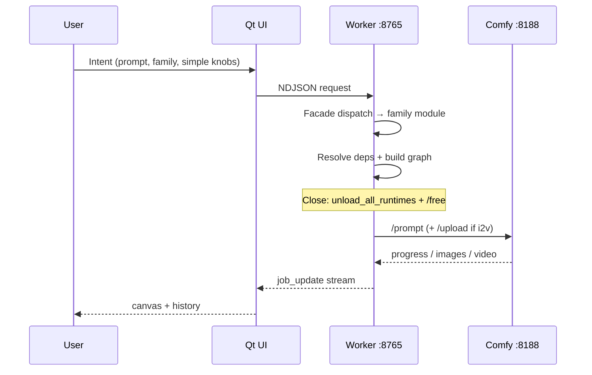

# System Map

```mermaid
sequenceDiagram
  participant U as User
  participant UI as Qt UI
  participant W as Worker :8765
  participant C as Comfy :8188
  U->>UI: Intent (prompt, family, simple knobs)
  UI->>W: NDJSON request
  W->>W: Facade dispatch → family module
  W->>W: Resolve deps + build graph
  Note over W: Close: unload_all_runtimes + /free
  W->>C: /prompt (+ /upload if i2v)
  C-->>W: progress / images / video
  W-->>UI: job_update stream
  UI-->>U: canvas + history
```

See also canvas: [[Architecture Overview]]
